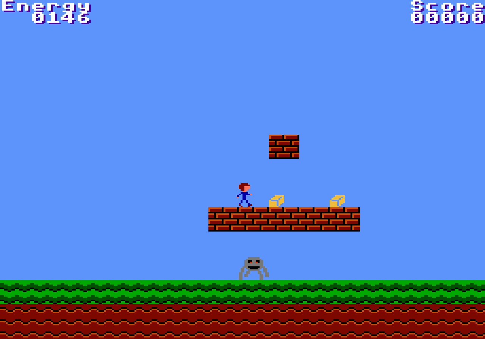

# Lil' Digger 2: The Revenge!

Lil Digger is my submission for Ludum Dare 40.

Lil Digger is for the Nintendo Entertainment System.

## Story

There is no story.  This is a continuation of Lil' Digger from LD39.
I wanted to explore writing a side-scroller on the NES.

Whereas the LD39 version took its inspiration from Atari Pitfall, you will
notice the inspiration from Nintendo Super Mario Brothers in this game.

Meta: The theme for "LD40" is "The more you have, the worse it is". The NES
is an old archaic platform with few tools and no CPU power.  Clearly it is
lacking "more".

## How to Play

This game is for the Nintendo Entertainment System.  In order to play it
you will need either an emulator or a real NES with a flash cart (such as
an Everdrive).

I've tested on *[fceux](https://lmgtfy.com/?q=fceux)* and with an *Everdrive* on a real NES.

## Contols

* D-Pad - left/right, climb ladders.
* A button - jump
* B button - run faster.
* Start - start game or pause game.

## Screenshot

## Resources

* My [LD39](https://github.com/cfrantz/ld39) Entry.
* [cc65](http://www.cc65.org)
* [unscii fonts](http://pelulamu.net/unscii/)
* [jmk/cc65-nes-examples](https://github.com/jmk/cc65-nes-examples).
